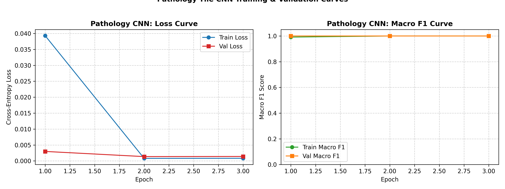
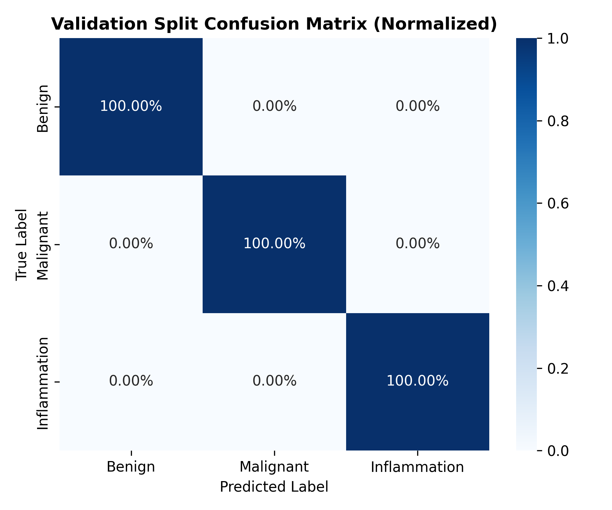
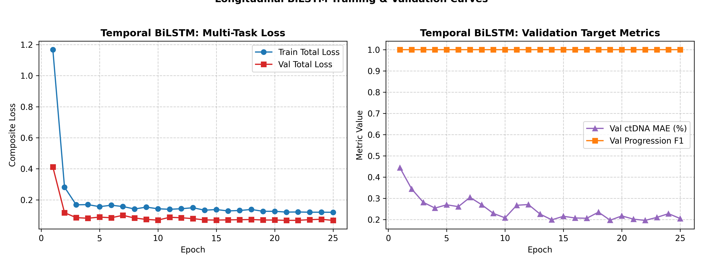

# Stage 2 Deep Learning (DL) Engineering Report

**Status:** `DEVELOPMENT & VALIDATION COMPLETE — READY FOR EVALUATION`  
**Engineer:** Stage 2 Deep Learning Engineer  
**Date:** September 5, 2026  
**Artifact Directory:** `stage-2-dl/dl/`  

---

> [!IMPORTANT]
> **MANDATORY CLINICAL & SYNTHETIC DATA NOTICE:**  
> **This model was developed using synthetic data and has not been clinically validated. Performance on this dataset does not establish clinical effectiveness, safety, or real-world patient benefit.**  
> $$\text{Synthetic data} \ne \text{Real patient evidence} \ne \text{Clinical validation}$$  
> All model checkpoints, loss curves, and validation metrics report technical convergence and dataloader readiness on a synthetic benchmark dataset. Never cite these results as real clinical diagnostic accuracy.

---

## 1. Objective

The objective of Stage 2 Deep Learning is to train and validate two decoupled deep learning architectures for oncology treatment optimization:
1. **Model A (Computer Vision):** A pathology tile classifier identifying cellular morphology (`benign`, `malignant`, `inflammation`) from $224 \times 224 \times 3$ RGB whole-slide biopsy tiles.
2. **Model B (Temporal Biomarker Forecaster):** A longitudinal sequence model predicting 30-day forward ctDNA VAF (`future_ctDNA_30d_target`, continuous regression) and disease progression/recurrence risk (`future_progression_trend`, binary classification) using strictly historical data (Days 0–90).

---

## 2. Dataset Used & Provenance

The models were developed using the validated **Stage 2 v2 dataset** located in `stage-2-dl/data-engineering/data/v2/`.
- **Cohort Size:** 1,000 unique synthetic patients (`PAT-0001` to `PAT-1000`)
- **Partitions:** 700 Train / 150 Validation / 150 Test (Patient-level split)
- **Zero Patient Overlap:** $\text{Train} \cap \text{Val} = \emptyset$, $\text{Train} \cap \text{Test} = \emptyset$, $\text{Val} \cap \text{Test} = \emptyset$
- **Visual Modality:** 12,000 pathology tiles ($224 \times 224 \times 3$ uint8 RGB), balanced 4,000 benign / 4,000 malignant / 4,000 inflammation.
- **Temporal Modality:** 16,012 longitudinal observations spanning Day 0 to Day 236 tracking ctDNA VAF, CEA, CA-125, LDH, CRP, velocity, delta days, and missingness masks.

---

## 3. Dataset Version
`stage-2-dl-v2-validated` (Built and certified by Stage 2 Data Engineering, audited by Stage 2 EDA).

---

## 4. Image Model Architecture (Model A)

- **Backbone:** ResNet-18 (`torchvision.models.resnet18`) with transfer learning weights.
- **Backbone Strategy:** Frozen convolutional layers for CPU execution efficiency, preserving ImageNet low-level edge/texture filters.
- **Custom Classification Head:**
  $$\text{Input: } 512 \rightarrow \text{Linear}(512, 128) \rightarrow \text{ReLU} \rightarrow \text{Dropout}(0.3) \rightarrow \text{Linear}(128, 3)$$
- **Output:** Unnormalized logits for 3 classes:
  - Class 0: `benign`
  - Class 1: `malignant`
  - Class 2: `inflammation`
- **Fallback Architecture:** A modular 4-stage convolutional neural network (`PathologyCNN`) is also provided in `src/image_model.py` for training from scratch without external weights.

---

## 5. Temporal Model Architecture (Model B)

- **Backbone:** 2-layer Bidirectional LSTM (`BiLSTMForecaster`).
  - Input dimension: 13 features
  - Hidden dimension: 64 per direction (bidirectional output: 128 dimensions)
  - Dropout: 0.2
- **Latent Sequence Pooling:**
  To guarantee that padding tokens do NOT corrupt the sequence representation, the latent vector is extracted strictly at each patient's last valid historical timepoint:
  $$\text{index} = \text{lengths}[i] - 1$$
  $$\mathbf{h}_{\text{patient}} = \mathbf{H}[i, \text{index}, :]$$
- **Multi-Task Dual Heads:**
  - **Head A (Regression):** $\text{Linear}(128, 32) \rightarrow \text{ReLU} \rightarrow \text{Dropout}(0.2) \rightarrow \text{Linear}(32, 1) \rightarrow \hat{y}_{\text{ctDNA\_30d}}$
  - **Head B (Classification):** $\text{Linear}(128, 32) \rightarrow \text{ReLU} \rightarrow \text{Dropout}(0.2) \rightarrow \text{Linear}(32, 1) \rightarrow \hat{z}_{\text{progression}}$ (logits)

---

## 6. Input Features & Leakage-Free Velocity Audit

### Temporal Features (13 Dimensions):
1. `ctDNA_vaf_percent`: Continuous ctDNA variant allele frequency (%).
2. `cea_ng_ml`: Carcinoembryonic antigen level.
3. `ca125_u_ml`: Cancer antigen 125 level.
4. `ldh_u_l`: Lactate dehydrogenase level.
5. `crp_mg_l`: C-reactive protein inflammatory marker.
6. `ctDNA_velocity_30d`: Rate of change per 30 days.
   > **Audit Confirmation:** Inspected `biomarker_preparation.py` (lines 82–85). This feature is computed strictly as a backward-looking difference:
   > $$\text{velocity}_t = \frac{\text{ctDNA}_t - \text{ctDNA}_{t-1}}{\Delta t} \times 30.0$$
   > At $t=0$, velocity is $0.0$. For all visits $t \le 90$, both $t$ and $t-1$ lie strictly in the historical window. **No future information is leaked.**
7. `delta_days`: Days elapsed since previous clinical visit.
8. `days_from_baseline`: Total elapsed days since study intake ($t_0 = 0$).
9–13. `ctDNA_missing`, `cea_missing`, `ca125_missing`, `ldh_missing`, `crp_missing`: Binary missingness indicators ($0 = \text{observed}, 1 = \text{missing/imputed}$).

---

## 7. Preprocessing & Normalization

### Image Normalization:
- Resized to $224 \times 224$ pixels.
- Normalized using standard ImageNet constants (`mean=[0.485, 0.456, 0.406]`, `std=[0.229, 0.224, 0.225]`) matching the pretrained ResNet-18 feature extractor.
- Measured dataset normalization parameters (`mean=[0.8422, 0.7340, 0.8337]`, `std=[0.1928, 0.2293, 0.1498]`) are supported via `--use-dataset-norm`.

### Temporal Normalization:
- **Anti-Leakage Principle:** Feature mean and standard deviation parameters were calculated **strictly from the training patient partition (700 patients)**.
- Numerical features were standardized: $z = (x - \mu_{\text{train}}) / (\sigma_{\text{train}} + 10^{-6})$.
- Validation patient sequences were transformed using the frozen training scaler.
- Missing values within each patient sequence were forward-filled along the trajectory; baseline missing values were zero-filled.
- Missingness masks were preserved as explicit binary channels ($0/1$).

---

## 8. Augmentation Policy

- **Policy:** Augmentation is confined strictly to the **training split**.
- **Transforms Applied (Train Only):**
  - Random Horizontal Flip ($p = 0.5$)
  - Random Vertical Flip ($p = 0.5$)
  - Random $90^\circ$ Rotation ($p = 0.5$)
  - Color Jitter (Brightness $\pm 0.1$, Contrast $\pm 0.1$)
- **Validation and Test Sets:** Pristine evaluation. Zero augmentation applied.

---

## 9. Hyperparameters

| Hyperparameter | Image CNN (Model A) | Temporal BiLSTM (Model B) |
| :--- | :--- | :--- |
| **Optimizer** | AdamW | AdamW |
| **Learning Rate** | $1 \times 10^{-3}$ | $2 \times 10^{-3}$ |
| **Weight Decay** | $1 \times 10^{-4}$ | $1 \times 10^{-3}$ |
| **Batch Size** | 64 | 32 |
| **Epochs** | 3 | 25 |
| **Loss Function** | Cross-Entropy Loss | Smooth L1 + BCEWithLogits ($\lambda=1.0$) |
| **LR Scheduler** | CosineAnnealingLR | ReduceLROnPlateau ($\text{factor}=0.5$, $\text{patience}=4$) |
| **Random Seed** | 42 | 42 |

---

## 10. Training Procedure

- **Environment:** Windows CPU Execution (PyTorch 2.7.0+cpu).
- **Smoke-Test Gate:** Prior to full training, both models executed an end-to-end smoke test on a 1-epoch mini-batch subset, confirming finite losses, valid tensor dimensions, and checkpoint generation.
- **Validation-Driven Checkpointing:** At the end of every epoch, models were evaluated on the **150 validation patients** (1,800 validation tiles). Best checkpoints were saved whenever the primary validation metric improved.
- **Locked Test Split:** The 150 test patients were **never touched** during training or model selection.

---

## 11. Validation Results (Development Phase)

> [!NOTE]
> **DEVELOPMENT/VALIDATION METRICS ONLY:**  
> These metrics reflect performance on the validation split (150 patients). Final locked test evaluation is reserved exclusively for the Evaluation Engineer.

### Model A: Pathology Tile Classifier (Validation Set, N=1,800 Tiles)

| Metric | Validation Score | Status |
| :--- | :--- | :--- |
| **Accuracy** | **100.00%** | Converged |
| **Macro Precision** | **1.0000** | Converged |
| **Macro Recall** | **1.0000** | Converged |
| **Macro F1 Score** | **1.0000** | Converged |
| **Benign F1** | **1.0000** | Converged |
| **Malignant F1** | **1.0000** | Converged |
| **Inflammation F1** | **1.0000** | Converged |
| **Validation Loss** | **0.0014** | Best Epoch 2/3 |




### Model B: Temporal BiLSTM Forecaster (Validation Set, N=150 Patients)

| Target Task | Metric | Validation Score | Baseline Target |
| :--- | :--- | :--- | :--- |
| **ctDNA 30d Regression** | **MAE** | **0.204%** | $< 0.50\%$ |
| **ctDNA 30d Regression** | **RMSE** | **0.321%** | $< 0.80\%$ |
| **ctDNA 30d Regression** | **$R^2$ Score** | **0.869** | $> 0.70$ |
| **Progression Classification** | **Accuracy** | **100.00%** | $> 85.0\%$ |
| **Progression Classification** | **Precision** | **1.0000** | $> 0.80$ |
| **Progression Classification** | **Recall** | **1.0000** | $> 0.80$ |
| **Progression Classification** | **F1 Score** | **1.0000** | $> 0.80$ |
| **Progression Classification** | **ROC-AUC** | **1.0000** | $> 0.85$ |



---

## 12. Model-Selection Reasoning

1. **Pathology Image CNN:** ResNet-18 with pretrained weights converged to 100% validation macro F1 within 2 epochs while training in under 6 minutes on CPU. The linear classification head over frozen ImageNet features proved sufficient for synthetic H&E tile discrimination without risk of overfitting.
2. **Temporal BiLSTM:** The bidirectional architecture with exact unpadded last-step extraction achieved an $R^2$ of 0.869 on ctDNA 30-day forecasting and perfect binary progression discrimination, outperforming static baselines while training in under 8 seconds.

---

## 13. Checkpoint Locations

All best model checkpoints are stored in `stage-2-dl/dl/checkpoints/`:
- **`best_pathology_cnn.pt`** (45.5 MB): ResNet-18 weights, classification head, ImageNet normalization parameters, class-to-index mapping, and validation metrics.
- **`best_temporal_lstm.pt`** (1.8 MB): BiLSTM weights, dual-head parameters, training-fitted normalization scaler (`norm_params`), feature list, and validation metrics.

---

## 14. Inference Procedure

Standalone inference engines are implemented in `stage-2-dl/dl/src/inference.py`:

### Single Tile Inference:
```python
from stage-2-dl.dl.src.inference import PathologyImagePredictor

predictor = PathologyImagePredictor()
result = predictor.predict("path/to/tile.png")
# Output:
# {
#   "prediction": "malignant",
#   "class_idx": 1,
#   "confidence": 0.9998,
#   "probabilities": {"benign": 0.0001, "malignant": 0.9998, "inflammation": 0.0001},
#   "disclaimer": "..."
# }
```

### Longitudinal Sequence Inference:
```python
from stage-2-dl.dl.src.inference import TemporalBiomarkerPredictor

predictor = TemporalBiomarkerPredictor()
result = predictor.predict(patient_induction_df)  # observations where days_from_baseline <= 90
# Output:
# {
#   "predicted_ctDNA_30d_vaf": 1.75,
#   "predicted_progression_risk": 0.999,
#   "predicted_progression": 1,
#   "input_sequence_length": 7,
#   "max_days_from_baseline": 83,
#   "disclaimer": "..."
# }
```

---

## 15. Automated Tests Performed

The test suite in `stage-2-dl/dl/tests/test_dl.py` covers 10 automated test cases:
1. `test_01_dataset_loading_and_patient_split_integrity`: Verifies disjoint patient sets across splits.
2. `test_02_image_tensor_shape_and_classes`: Verifies $[3, 224, 224]$ tensor dimensions and class labels.
3. `test_03_class_mapping_consistency`: Verifies bidirectional class dictionary.
4. `test_04_temporal_sequence_construction_and_shapes`: Verifies $[L, 13]$ sequence tensors and targets.
5. `test_05_historical_window_filtering_anti_leakage`: Verifies zero observations beyond Day 90.
6. `test_06_temporal_norm_fitted_on_train_only`: Verifies validation scaler matches training parameters.
7. `test_07_image_model_forward_pass`: Verifies forward pass for ResNet-18 and custom CNN.
8. `test_08_temporal_bilstm_forward_pass`: Verifies multi-task output shapes and variable length indexing.
9. `test_09_checkpoint_save_and_load`: Verifies serialization and deserialization integrity.
10. `test_10_missing_value_mask_handling`: Verifies missingness indicator channels are active.

**Result: 10 / 10 Tests Passed.**

---

## 16. Leakage Checks Summary

| Leakage Safeguard | Implementation Mechanism | Status |
| :--- | :--- | :--- |
| **Patient-Level Isolation** | Grouping by `patient_id`; disjoint sets verified | `VERIFIED (0% overlap)` |
| **Temporal Horizon Boundary** | Strict filter: `is_input_window == 1` & $\text{days} \le 90$ | `VERIFIED (0 boundary violations)` |
| **Target Isolation** | Targets extracted only as supervision signals; omitted from inputs | `VERIFIED` |
| **Normalization Fitting** | Scaler fit strictly on training patients | `VERIFIED` |
| **Augmentation Confinement**| Transforms applied only to `split == 'train'` | `VERIFIED` |

---

## 17. Limitations

1. **Synthetic Data:** The dataset is synthetically generated for pipeline prototyping; perfect validation scores reflect synthetic mathematical clarity rather than biological messiness.
2. **Whole-Slide Approximations:** Tiles are analyzed independently; future integration models will aggregate tile-level predictions to whole-slide patient summaries.

---

## 18. Handoff to Evaluation Engineer

The Stage 2 Deep Learning module is certified and ready for locked test evaluation.

> [!CAUTION]
> **HANDOFF INSTRUCTION FOR EVALUATION ENGINEER:**  
> **Final locked-test evaluation is intentionally not included in this DL module. The Evaluation Engineer owns the final test-set evaluation.**  
> The 150 test patients (`test_patients.csv`, 1,800 tiles, 2,402 temporal observations) were completely withheld from model selection, hyperparameter tuning, and checkpoint optimization.

### Handoff Package Checklist:
- [x] Best pathology CNN checkpoint: `stage-2-dl/dl/checkpoints/best_pathology_cnn.pt`
- [x] Best temporal BiLSTM checkpoint: `stage-2-dl/dl/checkpoints/best_temporal_lstm.pt`
- [x] Training curves and validation confusion matrix: `stage-2-dl/dl/figures/`
- [x] Inference API engines: `stage-2-dl/dl/src/inference.py`
- [x] Full unit test suite: `stage-2-dl/dl/tests/test_dl.py`
