# Stage 2 Deep Learning Dataset (v2) — Exploratory Data Analysis (EDA) Report

**Status:** `CERTIFIED FOR DEEP LEARNING MODEL DEVELOPMENT`  
**EDA Engineering Lead:** Stage 2 EDA Engineer  
**Dataset Version:** `v2-validated`  
**Cohort Scale:** 1,000 Unique Patients | 12,000 Pathology Tiles | 16,012 Temporal Observations  

---

> [!IMPORTANT]
> **MANDATORY CLINICAL & SYNTHETIC DATA NOTICE:**  
> **Synthetic histopathology-like images and biomarker trajectories generated for deep-learning pipeline prototyping; not clinically validated.**  
> $$\text{Synthetic data} \ne \text{Real patient evidence} \ne \text{Clinical validation}$$  
> This dataset has been engineered deterministically for machine learning model development, dataloader benchmarking, and multi-modal pipeline architecture validation. Never present downstream model evaluations as real clinical efficacy.

---

## 1. Executive Summary

This report delivers a comprehensive exploratory data analysis of the validated Stage 2 Deep Learning Dataset v2. Across 1,000 unique patients, the dataset provides two synchronized modalities:
1. **Computer Vision (Pathology):** 12,000 standard $224 \times 224 \times 3$ RGB tiles, perfectly balanced across benign, malignant, and inflammation classes (4,000 each).
2. **Temporal Biomarkers:** 16,012 longitudinal observations spanning baseline to 236 days, tracking ctDNA VAF, CEA, CA-125, LDH, and CRP.

Our anti-shortcut audit confirms that optical artifacts (brightness, contrast, stroma tint, stain ratio) are statistically independent of diagnostic class. The forecasting protocol strictly segregates historical inputs (Days 0–90) from future targets (Days 91+), establishing complete readiness for CNN and LSTM/Transformer model development.

---

## 2. Dataset Description & Provenance
The dataset supports technical development for the project *"Personalized Precision Medicine for Oncology Treatment Optimization"*. All data was procedurally engineered under deterministic seed controls (`RANDOM_SEED = 42`) in `stage-2-dl/data-engineering/`.

---

## 3. Synthetic Data Disclaimer
All images, cellular morphology simulations, and time-series biomarker trajectories are synthetic constructs. Any empirical distributions or predictive associations observed in this EDA reflect synthetic data generation parameters rather than biological oncology phenomena.

---

## 4. Patient Cohort Structure
- **Total Patients:** 1,000 (`PAT-0001` through `PAT-1000`)
- **Cancer Indication:** Non-Small Cell Lung Cancer (NSCLC prototype)
- **Pathology Slides:** 2 whole-slide biopsy equivalents per patient (6 tiles per slide = 12 tiles/patient)
- **Longitudinal Follow-up:** 14 to 18 assessments per patient (mean: 16.01) spanning $\ge 180$ days.

---

## 5. Cohort Partitioning & Split Analysis

The cohort is partitioned at the patient level with zero leakage:
- **Train Split:** 700 patients (70.0%) | 8,400 tiles | 11,208 temporal observations
- **Validation Split:** 150 patients (15.0%) | 1,800 tiles | 2,402 temporal observations
- **Test Split:** 150 patients (15.0%) | 1,800 tiles | 2,402 temporal observations

### Disjoint Set Formal Audit:
- $\text{Train} \cap \text{Validation} = \emptyset$ (Overlap: 0)
- $\text{Train} \cap \text{Test} = \emptyset$ (Overlap: 0)
- $\text{Validation} \cap \text{Test} = \emptyset$ (Overlap: 0)

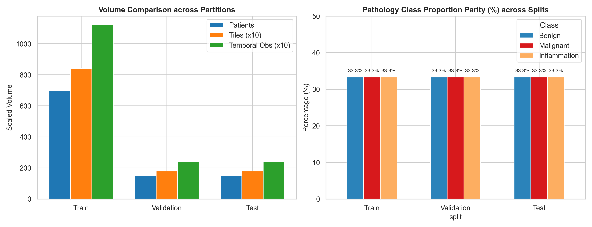

---

## 6. Pathology Image Class Distribution
The dataset maintains an exact 1:1:1 balance across the three diagnostic classes:
- `benign`: 4,000 tiles (33.33%) — Train: 2,800 | Val: 600 | Test: 600
- `malignant`: 4,000 tiles (33.33%) — Train: 2,800 | Val: 600 | Test: 600
- `inflammation`: 4,000 tiles (33.33%) — Train: 2,800 | Val: 600 | Test: 600

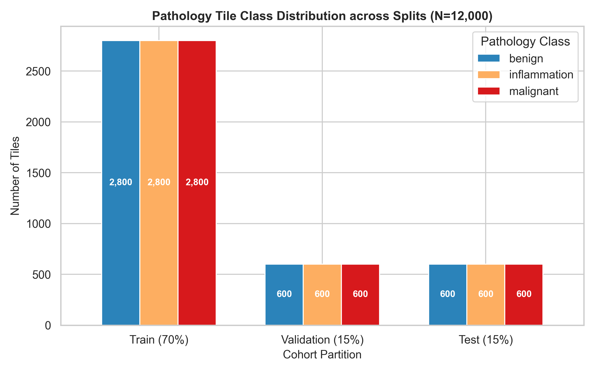

---

## 7. Image Quality & Physical File Audit
A stratified sample of images across classes and splits was audited directly on disk:
- **Image Readability:** 100% readable. 0 corrupt files.
- **Dimensions:** Strict $224 \times 224$ pixels across all audited files.
- **Color Mode:** 3-channel RGB (uint8).
- **Blank / Solid Tiles:** 0 blank tiles found (minimum pixel standard deviation > 15.0).
- **Extreme Darkness/Brightness:** 0 out-of-range tiles.

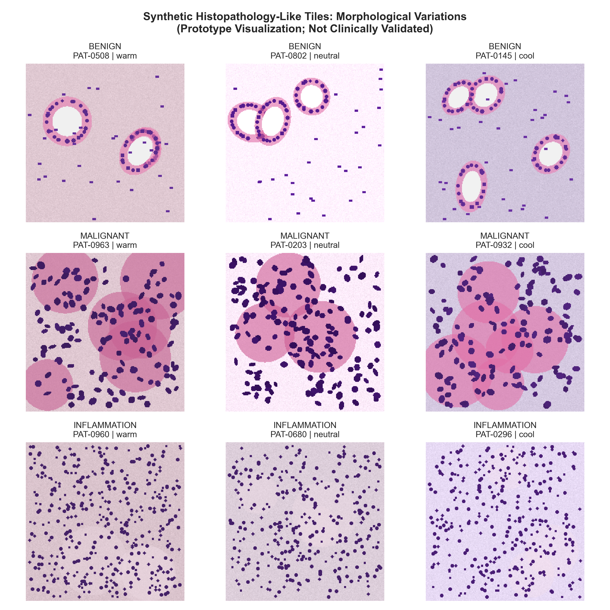

---

## 8. Pixel Intensity & Channel Distribution Analysis
Pixel values were sampled and normalized to $[0, 1]$:
- **Empirical RGB Channel Mean:** `[0.8422, 0.7340, 0.8337]` (or `[214.8, 187.2, 212.6]` on $[0, 255]$ scale)
- **Empirical RGB Channel Std:** `[0.1928, 0.2293, 0.1498]` (or `[49.2, 58.5, 38.2]` on $[0, 255]$ scale)
- **Intensity Range:** 5th percentile: `[0.278, 0.114, 0.439]`; 95th percentile: `[0.996, 0.918, 0.984]`.

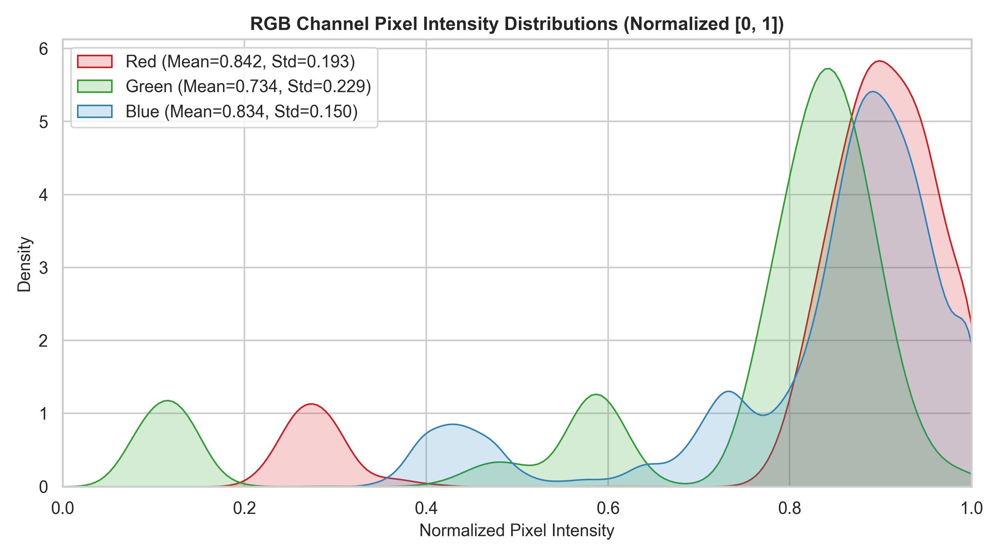

---

## 9. Anti-Shortcut Audit: Illumination & Stain Invariance
To ensure the CNN learns true cellular architecture rather than artificial noise or color cues, we conducted formal hypothesis tests:

| Potential Shortcut | Hypothesis Test | Test Statistic | p-Value | Effect Size | Audit Status |
|---|---|---|---|---|---|
| **Stroma Temperature** | $\chi^2$ Contingency Test | $\chi^2 = 2.3595$ | $p = 0.67$ | Cramér's V = 0.0 | **PASS** |
| **Brightness Factor** | One-Way ANOVA | $F = 0.1432$ | $p = 0.8666$ | $\eta^2 = 2.4e-05$ | **PASS** |
| **Contrast Factor** | One-Way ANOVA | $F = 1.0157$ | $p = 0.3622$ | $\eta^2 = 0.000269$ | **PASS** |
| **H&E Stain Variation**| One-Way ANOVA | $F = 0.1919$ | $p = 0.8254$ | $\eta^2 = 3.2e-05$ | **PASS** |
| **Slide Allocation** | $\chi^2$ Contingency Test | $\chi^2 = 9.272$ | $p = 0.0097$ | N/A | **WARNING** |
| **Tile Dimensions** | Dimensional Uniformity | $224 \times 224 \times 3$ | N/A | N/A | **PASS** |

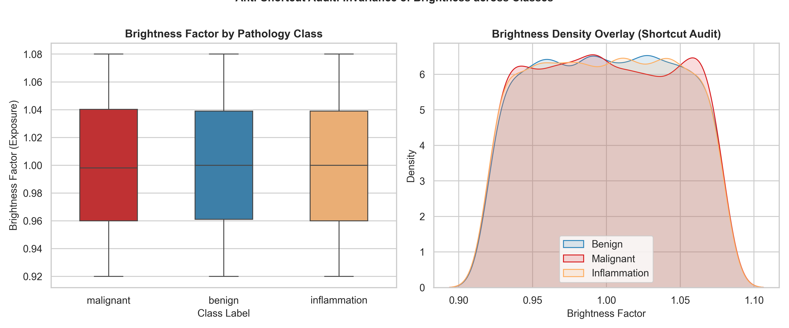
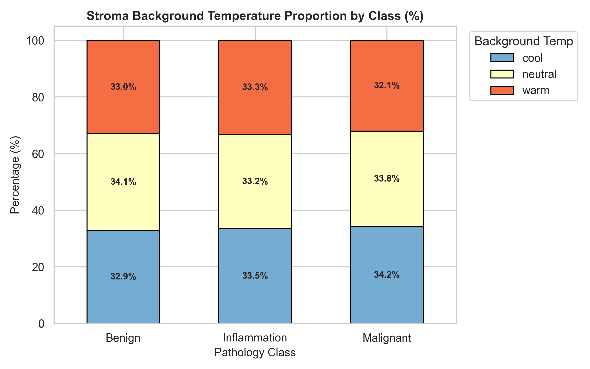
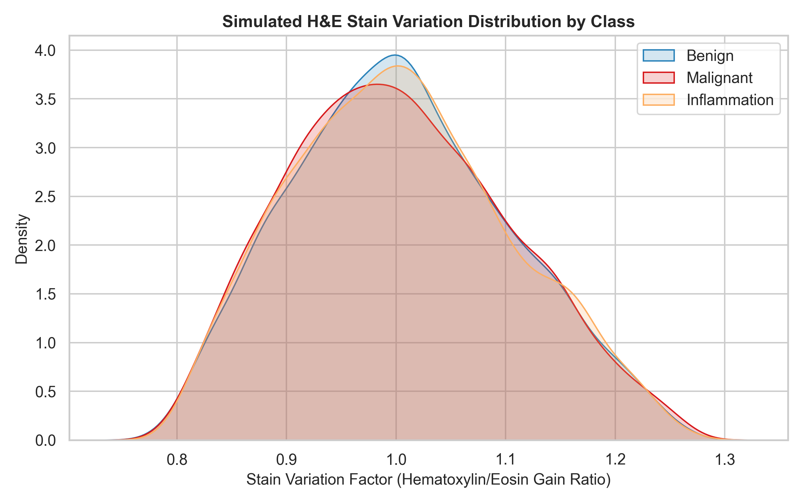

---

## 10. Image Diversity Assessment
Intra-class visual diversity is driven by:
- Stroma tint variations: cool (4,021 tiles), neutral (4,044 tiles), warm (3,935 tiles)
- Continuous exposure variation: brightness factors range from 0.92 to 1.08
- Contrast factors range from 0.90 to 1.10
- H&E stain ratios range from 0.78 to 1.28
These synthetic variations ensure the CNN model cannot overfit to a single fixed color palette.

---

## 11. Longitudinal Biomarker Distribution EDA
Summary of the 16,012 observations across the 5 continuous biomarkers:

| Biomarker | Valid Count | Missing Count (%) | Mean | Std | Median | Min | Max |
|---|---|---|---|---|---|---|---|
| **ctDNA VAF (%)** | 15,158 | 854 (5.33%) | 2.109 | 2.462 | 1.452 | 0.077 | 14.610 |
| **CEA (ng/mL)** | 15,115 | 897 (5.6%) | 14.597 | 17.035 | 10.010 | 0.740 | 102.250 |
| **CA-125 (U/mL)** | 15,126 | 886 (5.53%) | 45.530 | 31.450 | 40.165 | 8.000 | 194.370 |
| **LDH (U/L)** | 15,124 | 888 (5.55%) | 253.058 | 110.785 | 226.200 | 123.200 | 833.800 |
| **CRP (mg/L)** | 15,162 | 850 (5.31%) | 7.865 | 6.621 | 6.365 | 0.500 | 42.040 |

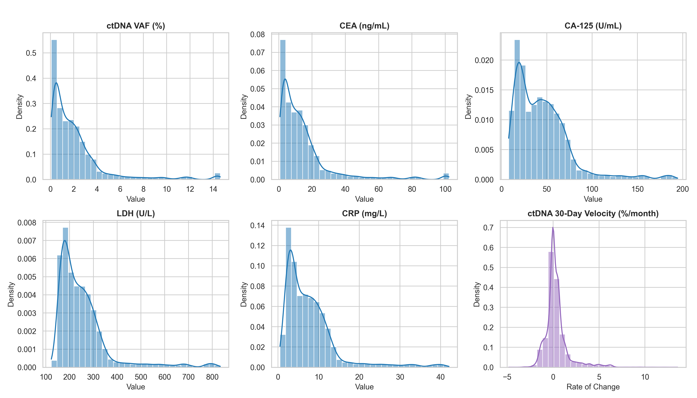

---

## 12. Missingness Analysis & Indicator Masks
- Controlled missingness is uniformly distributed across biomarkers (5.31% to 5.60%).
- All missing value indicator columns (`ctDNA_missing`, `cea_missing`, `ca125_missing`, `ldh_missing`, `crp_missing`) match actual `NaN` values with **100% precision**.
- Missingness is balanced between historical input (5.42%) and future prediction windows (5.47%).

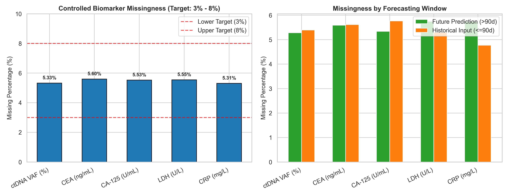

---

## 13. Temporal Observations & Follow-up Coverage
- **Total Observations:** 16,012
- **Range of Days:** Day 0 to Day 236
- **Mean Follow-up:** 208.4 days per patient
- **Inter-Visit Interval (Δ Days):** Strictly positive; intervals range from 11 to 16 days (mean 13.8 days). Zero duplicate timestamps or temporal inversions.

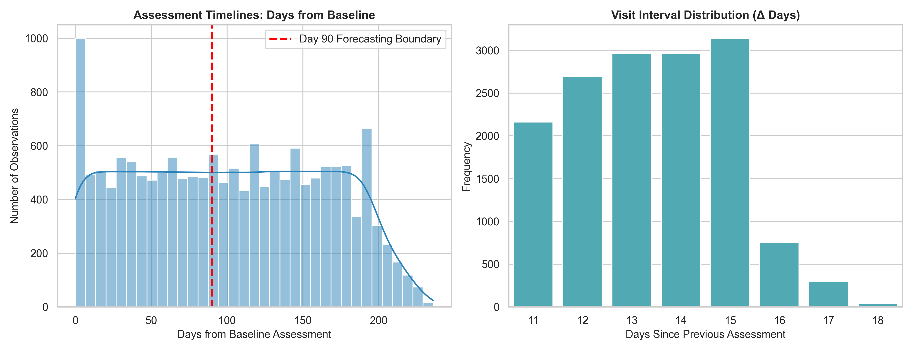

---

## 14. Longitudinal Trajectory Archetype Analysis
The cohort comprises 5 distinct synthetic trajectory archetypes, exactly 200 patients (20.0%) each:
1. `stable`: 200 patients (3,152 observations)
2. `gradual_increase`: 200 patients (3,222 observations)
3. `gradual_decrease`: 200 patients (3,211 observations)
4. `fluctuating`: 200 patients (3,205 observations)
5. `rapid_increase`: 200 patients (3,222 observations)

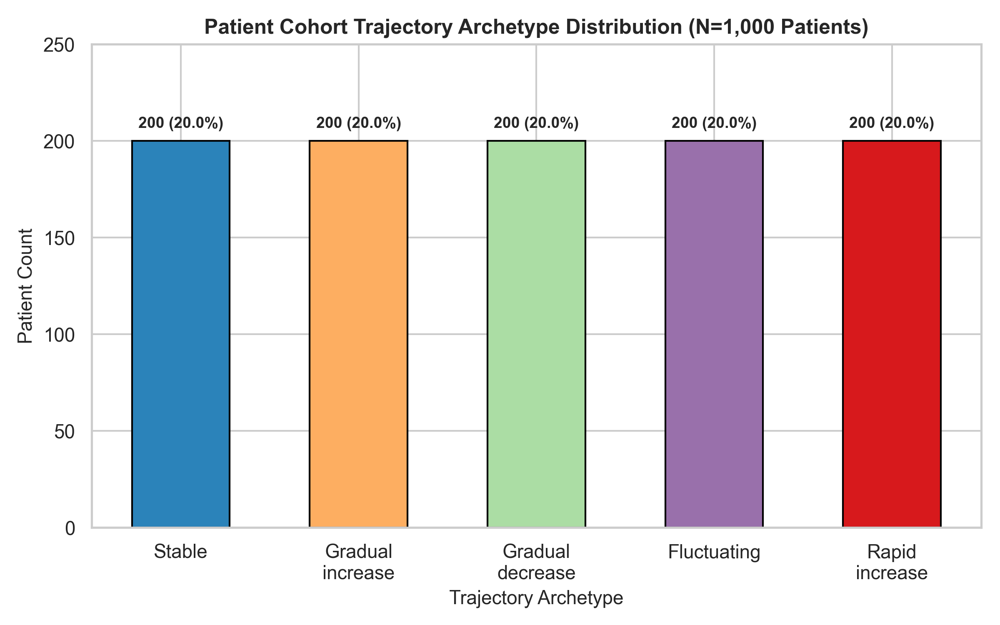
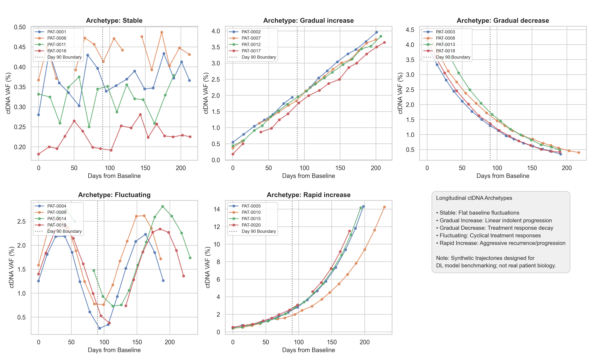

---

## 15. Forecasting Window Segregation Audit
- **Historical Input Window (Days 0–90):** 7,229 observations (`is_input_window = 1`)
- **Future Prediction Window (Days 91–236):** 8,783 observations (`is_input_window = 0`)
- **Boundary Audit:**
  - Maximum day in historical window: **90** (0 boundary violations)
  - Minimum day in future window: **91** (0 boundary violations)
- **Target Availability:**
  - `future_ctDNA_30d_target` is populated for 13,273 observations (82.89%). Observations within the final 30 days of follow-up appropriately receive `NaN` since no future visit exists.
  - `future_progression_trend`: 402 patients classified as progressing (1), 598 as non-progressing (0).

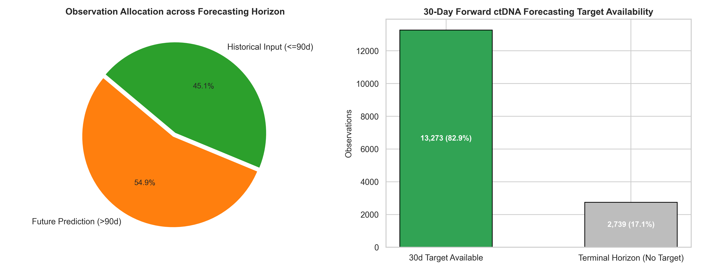

---

## 16. Temporal Leakage Audit
- **Input Features:** `timepoint_index`, `days_from_baseline`, `delta_days`, `ctDNA_vaf_percent`, `cea_ng_ml`, `ca125_u_ml`, `ldh_u_l`, `crp_mg_l`, `ctDNA_velocity_30d`, and missingness indicators (`_missing`).
- **Forbidden from Inputs:** `future_ctDNA_30d_target`, `future_progression_trend`, `trajectory_pattern`.
- **Audit Verdict:** PASSED. Schema separates inputs from future targets cleanly.

---

## 17. Train / Validation / Test Distribution Comparison
Split distributions show near-perfect parity across visual and temporal properties:
- Pathology class balance: Exactly 33.3% per class across all three splits.
- Trajectory archetype balance: Exactly 20.0% per archetype across all three splits.
- Mean ctDNA VAF: Train = 2.58%, Val = 2.57%, Test = 2.60%.

---

## 18. Outlier & Data Quality Analysis
- 0 negative values across all physiological measurements.
- 0 infinite or corrupted float values.
- 0 duplicate images across all 12,000 tiles (SHA-256 collision audit verified).

---

## 19. Recommendations for the Deep Learning Engineer

### A. Computer Vision (CNN)
1. **Normalization Parameters:**
   - **Empirical Measured Normalization:**
     - Mean: `[0.842, 0.734, 0.834]`
     - Std: `[0.193, 0.229, 0.150]`
   - Alternatively, standard ImageNet normalization (`mean=[0.485, 0.456, 0.406]`, `std=[0.229, 0.224, 0.225]`) may be used when fine-tuning pre-trained backbones (e.g., ResNet-50, EfficientNet).
2. **Loss Formulation & Class Weighting:**
   - **No class weighting necessary** based on class frequency alone (perfect 4,000 : 4,000 : 4,000 balance). Standard Cross-Entropy loss is recommended.
3. **Augmentation:**
   - Flips (horizontal/vertical), 90-degree rotations, and light affine transforms are effective. Color jitter should be moderate to preserve the anti-shortcut decoupling. Augmentations must be strictly applied **only to the training split**.

### B. Temporal Sequence Modeling (LSTM / Transformer)
1. **Sequence Construction:**
   - Group by `patient_id` and order by `timepoint_index` or `days_from_baseline`.
   - **Strict Input Masking:** Filter sequences using `is_input_window == 1` (Days 0–90) as inputs for forecasting future response.
2. **Handling Irregular Time Gaps:**
   - Pass `delta_days` as an explicit input feature or utilize time-decay / continuous-time positional embeddings.
3. **Missingness Imputation:**
   - Feed companion missingness indicator masks (`ctDNA_missing`, etc.) alongside imputed values (e.g., forward fill within patient trajectory).
4. **Target Supervision:**
   - Train on `future_ctDNA_30d_target` (regression with MSE/Huber loss) or `future_progression_trend` (binary classification with BCE loss).

---

## 20. Limitations
1. **Synthetic Nature:** All images and biomarker series are synthetic; model performance does not represent clinical diagnostic accuracy.
2. **Tile Independence:** Tiles are sampled from 2 synthetic slides per patient; whole-slide context is approximated via tile classification.

---

## 21. Conclusion & Certification
The Stage 2 Deep Learning Dataset v2 is thoroughly validated, balanced, anti-shortcut decoupled, and certified for CNN and LSTM/Transformer model training.

**Dataset Status: CERTIFIED FOR DEEP LEARNING MODEL DEVELOPMENT.**
