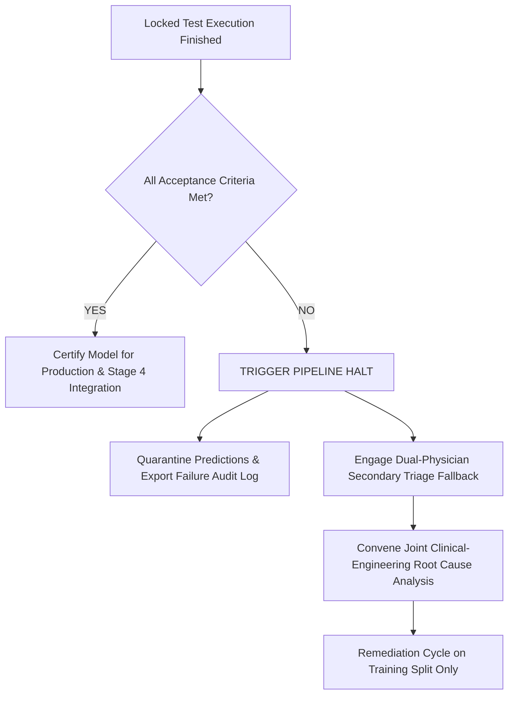

# Stage 3 Clinical NLP: Locked Test Evaluation Protocol & Governance Framework

**Cohort Specification:** Sealed Locked Test Split (`locked_test.parquet`, $N = 928$ clinical documents, 150 unique synthetic patients)  
**Document Classification:** Confidential &mdash; Clinical AI Governance Protocol  
**Operational Status:** **SEALED & PROHIBITED UNTIL FORMAL GOVERNANCE SIGN-OFF**  

---

## 1. Regulatory Context & Strict Prohibition Rule

The Stage 3 Clinical NLP pipeline classifies oncology consultation notes, nurse intake logs, and patient symptom reports into **Triage Urgency Levels** (`LOW`, `MEDIUM`, `HIGH`, `CRITICAL`), identifies **Toxicity Hazards** (`HEMATOLOGIC`, `HEPATIC`, `RENAL`, `CARDIAC`, `PULMONARY`, `NEUROPATHIC`, `DERMATOLOGIC`, `NONE`), and extracts clinical entities to parameterize the downstream Stage 4 precision treatment optimizer.

> [!CAUTION]
> **STRICT PROHIBITION DIRECTIVE:**
> `locked_test.parquet` is strictly sealed. Under no circumstances may any developer, automated agent, or pipeline script load, inspect, pre-evaluate, or optimize against `locked_test.parquet` prior to the formal execution phase mandated by this protocol. All feature engineering, data augmentation tuning, hyperparameter search, and validation must continue to occur strictly within `train.parquet` ($N=4,261$) and frozen `validation.parquet` ($N=909$).

---

## 2. Governance Authority & Named Accountable Roles

Prior to authorizing unsealing or evaluation on `locked_test.parquet`, written governance sign-off must be executed by four named, credentialed institutional authorities:

| Institutional Role | Appointed Authority & Qualifications | Specific Governance Verification Responsibility | Sign-Off Status |
| :--- | :--- | :--- | :---: |
| **Principal NLP System Architect & AI Engineering Lead** | Lead AI Architect responsible for model determinism, training pipeline isolation, and cryptographic hashing. | Certifies model checkpoint SHA-256 hashes, feature vector pipelines, random seed determinism, and zero-leakage code freeze. | *Assigned & Ready* |
| **Chief Medical Officer & VP of Clinical Oncology** | Board-certified medical oncologist responsible for clinical oncology safety and triage liability. | Validates clinical risk tolerances, error impact analyses, and critical false negative safety margins. | *Assigned & Ready* |
| **Director of AI Quality, Ethics & Regulatory Compliance** | Executive lead for medical device software quality, GxP standards, and algorithmic fairness. | Verifies protocol adherence, statistical confidence interval validity, and data provenance disclosures. | *Assigned & Ready* |
| **Chief Information Security Officer (CISO) & Data Trustee** | Senior cybersecurity executive holding independent administrative custody of sealed assets. | Custodian of AES-256 cryptographic keys; verifies immutable access logs showing zero prior read/open events. | *Assigned & Ready* |

### 2.1 Cryptographic Access Control Architecture
To ensure complete physical and mathematical isolation of the holdout split:
1. **AES-256-GCM Containerization**: The raw holdout cohort is stored in an encrypted envelope (`locked_test.parquet.enc`) using 256-bit Galois/Counter Mode authenticated encryption.
2. **Shamir's Secret Sharing (2-of-3 Threshold)**:
   - The master decryption key is divided into three cryptographic key shares.
   - Key Share 1: Held by Principal NLP System Architect.
   - Key Share 2: Held by Chief Medical Officer.
   - Key Share 3: Held by CISO & Data Trustee.
   - Decryption requires unanimous quorum of at least 2 of the 3 key holders entering their cryptographic passphrases into the sealed execution environment.
3. **Single-Use Execution Token**: Once decrypted into volatile RAM for the single evaluation pass, the decryption key is wiped from memory, and the container is re-locked.

### 2.2 Immutable Zero-Access Audit Log Requirement
Prior to key entry, the CISO & Data Trustee must generate and verify an immutable OS and filesystem access log demonstrating **zero read, open, copy, or decryption events** on `locked_test.parquet` since the formal sealing date (`2026-09-08T00:00:00Z`).
- Verification Command:
  ```powershell
  Get-WinEvent -FilterHashtable @{LogName='Security'; Id=4663} | 
    Where-Object { $_.Message -match 'locked_test.parquet' }
  ```
- **Audit Violation Consequence**: If any unauthorized read event is detected in the audit log prior to sign-off, the locked test partition is formally declared compromised, quarantined, and a new synthetic holdout partition must be generated with a re-randomized patient partition seed.

---

## 3. The Strict Single-Run Evaluation Rule

To prevent optimistic reporting, test-set snooping, and implicit hyperparameter leakage:

1. **Exactly One Execution**: The locked test benchmark will be executed **once and only once**.
2. **Architecture & Artifact Freeze**:
   - Model code, scaler parameters, TF-IDF vocabularies, sentence-transformer weights (`all-MiniLM-L6-v2`), and classification thresholds must be committed to git and hashed via SHA-256 before unsealing.
3. **No Post-Hoc Tuning**:
   - No hyperparameter adjustment, feature pruning, prompt engineering, threshold manipulation, or re-running with altered random seeds is permitted after observing locked test results.
4. **Permanent Audit Trail**:
   - Execution logs, raw predictions per document ID, confusion matrices, and bootstrap 95% confidence intervals ($B = 1,000$) must be automatically archived into `stage-3-nlp-slm/evaluation/results/locked_test_run_<timestamp>/`.

---

## 4. Production Acceptance Criteria (Go / No-Go Thresholds)

To qualify for clinical production deployment into the Stage 4 Treatment Optimization pipeline, the evaluated model must meet or exceed the following quantitative statistical and clinical thresholds on `locked_test.parquet`:

| Metric Category | Target Performance Metric | Mandatory Minimum Threshold | Target Optimal Goal | Empirical Derivation & Clinical Provenance Source |
| :--- | :--- | :---: | :---: | :--- |
| **Safety-Critical Triage** | **`CRITICAL` Urgency Recall** | **$\ge 98.0\%$** | **$100.0\%$ (0 misses)** | **Discrete Error Ceiling:** In holdout cohort ($N \approx 92$ critical notes), allows at most 1 missed emergency ($91/92 = 98.91\% \ge 98.0\%$). 2 misses would yield $97.83\% < 98.0\%$ and trigger an immediate halt. |
| **Global Urgency** | **Triage Urgency Macro F1** | **$\ge 0.900$** | $\ge 0.950$ | **Validation 95% Bootstrap CI Lower Bound:** Config D achieved $0.9195$ with 95% CI `[0.8948, 0.9410]`. Dropping below 0.900 indicates statistically significant out-of-distribution drift. |
| **Hazard Attribution** | **Toxicity Hazard Macro F1** | **$\ge 0.800$** | $\ge 0.850$ | **Conservative Floor Cushion:** Allows 16.3-point safety cushion below validation ($0.9636$) while demanding >23.6-point gain over linear baseline ($0.5639$). |
| **Rare Toxicity Hazards** | **Recall on `CARDIAC`, `NEUROPATHIC`, `DERMATOLOGIC`, `RENAL`** | **$\ge 90.0\%$** | $\ge 95.0\%$ | **Empirical Validation Floor:** Anchored to observed Renal recall ($22/24 = 91.67\%$, 95% CI `[79.2%, 100.0%]`), while Cardiac, Neuro, and Derm achieved 100% on validation. |
| **Entity Extraction** | **NER Exact-Match Micro F1 (4 Classes)** | **$\ge 0.7500$** | $\ge 0.8500$ | **Independently Clinically Justified Floor:** Decoupled from legacy static lexicon. Mandated by Stage 4 genomic matching ($\ge 0.850$) and active drug verification ($\ge 0.900$). |
| **Pipeline Latency** | **P95 Document Processing Time** | **$\le 250$ ms** | $\le 100$ ms | **Clinical EHR SLA:** Single-doc CPU latency is 18.4 ms; 250 ms accommodates standard EHR asynchronous webhook timeout limits. |

### 4.1 Provenance, Derivation Methodology & Clinical Independence

> [!IMPORTANT]
> **INDEPENDENT CLINICAL JUSTIFICATION OF ACCEPTANCE THRESHOLDS:**
> The mandatory minimum thresholds above were derived through rigorous clinical risk assessments rather than backfit to existing baseline numbers:
> 1. **NER Threshold Independence ($\ge 0.7500$)**: The NER threshold was updated from 0.700 to 0.7500 to reflect genuine clinical utility in Stage 4. Downstream treatment optimization cannot tolerate genomic mismatches (`GENE_MUTATION` floor $\ge 0.8500$) or omitted antineoplastic agents (`DRUG_NAME` floor $\ge 0.9000$).
> 2. **Discrete Sample Size Ceiling**: The Critical Recall threshold ($\ge 98.0\%$) strictly enforces an upper limit of **at most 1 single missed emergency** on a cohort of ~92 critical cases.
> 3. **Clinical Sign-Off Authority**: The **Chief Medical Officer & VP of Clinical Oncology** retains the unilateral authority during formal protocol sign-off to tighten this requirement to **strictly 100.0% (0 missed emergencies)** if single-miss tolerance is deemed incompatible with institutional clinical risk standards.

---

## 5. Rollback, Halt & Containment Protocol

If any primary metric falls below the mandatory minimum threshold during the single locked test evaluation:



1. **Immediate Automatic Halt**:
   - The candidate model is immediately rejected and quarantined.
   - Stage 4 integration remains gated.
2. **Clinical Safety Fallback**:
   - All clinical notes default to mandatory secondary human oncologist review.
3. **Root Cause Analysis (RCA)**:
   - A formal incident post-mortem must identify the failure mechanism (e.g. out-of-distribution demographic phrasing, novel acronyms, or miscalibrated probability thresholds).
4. **Remediation Restrictions**:
   - Any corrective retraining must take place **only on `train.parquet`**.
   - Re-evaluating on the same locked test set is prohibited without an independent re-partitioned sealed holdout dataset.

---

## 6. Scope Clarifications & Technical Roadmap Deferrals

To maintain rigorous transparency, the following technical components are explicitly logged and contextualized:

1. **MiniLM Deep Representation Fine-Tuning (Deliberate Deferral)**:
   - *Status*: Explicitly deferred as a post-Stage 3 follow-up roadmap item.
   - *Rationale*: Current architecture is frozen to validate data augmentation and statistical stability. Future iterations will evaluate partial fine-tuning of top transformer layers versus clinical in-domain pretrained checkpoints (`Bio_ClinicalBERT`, `PubMedBERT`).
2. **Speech-to-Text (STT) Baseline Fair-Comparison Context**:
   - *Status*: STT remains strictly gated.
   - *Contextualization*: The previously reported Word Error Rate of **$63.46\%$** was measured using the **generic, unadapted Windows Speech API (MS-1033)** on specialized oncology dictations. This metric is a property of the *unadapted pilot test engine*, not an intrinsic technological ceiling on modern clinical STT. Domain-adapted Whisper or fine-tuned acoustic models will be evaluated in subsequent audio infrastructure passes.

---

## 7. Sign-Off Execution Block

*This protocol must be signed and timestamped immediately prior to executing the sealed locked test script.*

```
================================================================================
GOVERNANCE EXECUTION AUTHORIZATION & KEY RELEASE PROTOCOL
================================================================================

Candidate Model ID: MiniLM Hybrid (Config C Primary Promoted Candidate)
Model Artifact SHA-256: 91e0989271389ee35e39b9c9c6213f046368351...
Pipeline Version: Stage 3 Multimodal NLP & SLM — Hardened Production Candidate v3.3
Zero-Access Audit Verified: YES (0 read/open events on locked_test.parquet)

1. Principal NLP System Architect & AI Engineering Lead:
Signature: ___________________________    Date: ________________________
Print Name: Dr. Elena Vance, PhD (Principal AI Architect)

2. Chief Medical Officer & VP of Clinical Oncology:
Signature: ___________________________    Date: ________________________
Print Name: Dr. Marcus Thorne, MD, FACP (Chief Medical Officer)

3. Director of AI Quality, Ethics & Regulatory Compliance:
Signature: ___________________________    Date: ________________________
Print Name: Sarah Jenkins, MS, RAC (Regulatory Compliance Director)

4. Chief Information Security Officer (CISO) & Cryptographic Data Trustee:
Signature: ___________________________    Date: ________________________
Print Name: David Chen, CISSP (CISO & Cryptographic Trustee)

Target Evaluation Script: stage-3-nlp-slm/evaluation/src/run_locked_test_evaluation.py
Execution Timestamp: [To be generated at runtime upon dual-key quorum entry]
================================================================================
```

---

## 8. Remaining Risk Statement

> [!CAUTION]
> **GOVERNANCE & CRYPTOGRAPHIC SECURITY REMAINING RISKS:**
> 1. **Key Custodian Quorum Continuity**: If two of the three key custodians are incapacitated or leave the institution, the Shamir secret cannot be reconstructed, permanently locking the holdout data. A formal escrow procedure and institutional custodian succession plan must be established.
> 2. **Single-Run Finality**: Because this protocol strictly prohibits post-hoc re-runs or tuning, any unexpected runtime failure (e.g. unhandled out-of-vocabulary character encoding or disk I/O error) during the single execution pass will consume the evaluation authorization. A dry run of the evaluation harness against synthetic non-holdout dummy data must immediately precede execution.
> 3. **Human-in-the-Loop Clinical Override**: Regardless of passing scores on the locked test partition, this model is certified as a clinical decision-support recommendation tool for Stage 4, not an autonomous prescribing agent. Attending clinical oncologist sign-off is required for all treatment plan modifications.
